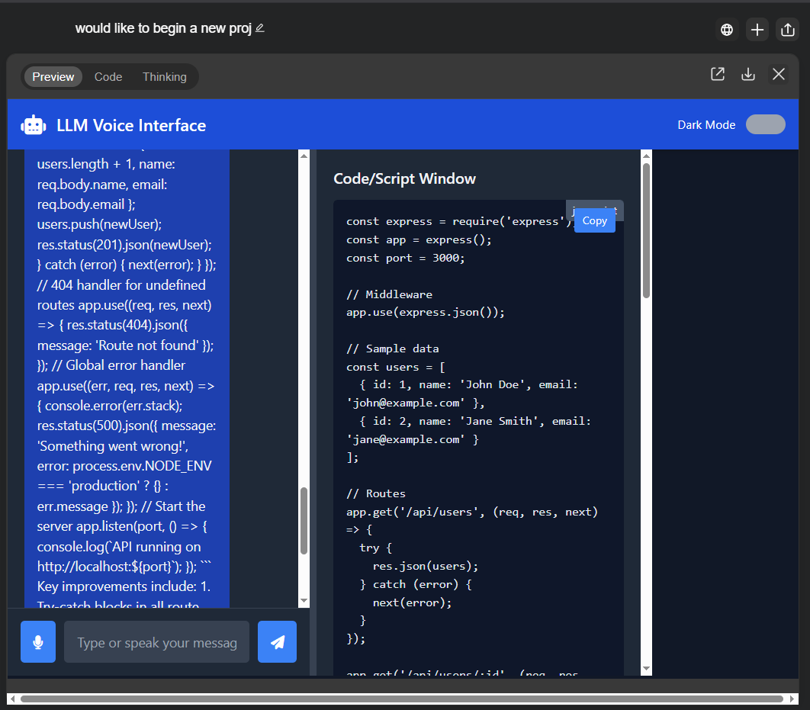

# super-agent-interface
LLM Voice Interface
# LLM Voice Interface

[](https://opensource.org/licenses/MIT)
[](https://nodejs.org/)
[](CONTRIBUTING.md)

A web-based interface for LLM agents with full conversational voice capabilities, featuring a separate window for code/script display. This project allows users to interact with advanced language models using both voice and text, with real-time responses in both modalities.



## 🌟 Features

- **Voice Interaction**: Seamless voice input and output with high-quality, low-latency synthesis
- **Text Conversation**: Real-time text display with proper formatting for messages
- **Code Display**: Separate window for viewing and copying generated code, with syntax highlighting
- **Responsive Design**: Works on desktop and mobile devices with adaptive layout
- **Multiple LLM Support**: Connect to different LLM providers (OpenAI by default)
- **Customizable Interface**: Resizable panels, dark/light theme option

## 🚀 Demo

Check out the [live demo](https://your-demo-url.com) to see the interface in action.

## 📋 Prerequisites

- [Node.js](https://nodejs.org/) (v14 or higher)
- [npm](https://www.npmjs.com/) or [yarn](https://yarnpkg.com/)
- An API key from [OpenAI](https://openai.com/) or another LLM provider
- A modern web browser with microphone access permission

## 💻 Installation

### Quick Start

1. **Clone the repository**

```bash
git clone https://github.com/yourusername/llm-voice-interface.git
cd llm-voice-interface
```

2. **Install dependencies**

```bash
npm install
```

3. **Set up environment variables**

```bash
cp .env.example .env
```

Edit the `.env` file and add your API keys and configuration.

4. **Start the development server**

```bash
npm run dev
```

5. **Open your browser**

Navigate to [http://localhost:3000](http://localhost:3000)

### Voice Synthesis Setup (Optional)

For high-quality voice output, you can set up Piper voice synthesis:

```bash
mkdir -p server/services/voice
cd server/services/voice

# Download Piper binary for your system (select the appropriate one)
wget https://github.com/rhasspy/piper/releases/download/v1.2.0/piper_amd64.tar.gz
tar -xzf piper_amd64.tar.gz

# Download a voice model
wget https://huggingface.co/rhasspy/piper-voices/resolve/v1.0.0/en/en_US/lessac/medium/en_US-lessac-medium.onnx
wget https://huggingface.co/rhasspy/piper-voices/resolve/v1.0.0/en/en_US/lessac/medium/en_US-lessac-medium.onnx.json
```

Update your `.env` file with the paths to these files:

```
PIPER_BINARY=server/services/voice/piper
VOICE_MODEL=server/services/voice/en_US-lessac-medium.onnx
```

## 🎮 Usage

### Starting a Conversation

- Type in the text box and press Enter or click Send
- Click the microphone button and speak your message
- The AI response will appear in the conversation panel and be spoken aloud


### Working with Code

- When the AI generates code, it will appear in the right panel
- Use the copy button to copy code to clipboard
- The code panel supports syntax highlighting for multiple languages


### Customizing the Interface

- Drag the divider between panels to resize them
- Toggle dark/light mode using the switch in the header
- Adjust voice settings in the server configuration

## 🧠 How It Works

### Architecture

The application uses a client-server architecture:


1. **Frontend**: HTML/CSS/JavaScript with WebSpeech API for voice recognition
2. **Backend**: Node.js with Express and Socket.io for real-time communication
3. **LLM Integration**: API connections to language models like GPT-4
4. **Voice Synthesis**: Piper for high-quality, low-latency voice output

### Technical Flow

1. User speaks or types a message
2. Message is sent to the server via WebSocket
3. Server forwards the message to the LLM API
4. LLM generates a response
5. Server processes the response and converts it to speech (if voice synthesis is enabled)
6. Response is sent back to the client
7. Client displays the text and plays the audio

## ⚙️ Configuration Options

Edit the `.env` file to configure:

| Variable | Description | Default |
|----------|-------------|---------|
| `PORT` | The port number for the server | 3000 |
| `OPENAI_API_KEY` | Your OpenAI API key | - |
| `OPENAI_MODEL` | The LLM model to use | gpt-4o |
| `PIPER_BINARY` | Path to the Piper binary | server/services/voice/piper |
| `VOICE_MODEL` | Path to the voice model file | server/services/voice/en_US-lessac-medium.onnx |

## 🔄 Alternatives and Extensions

### Alternative Voice Recognition

- **Google Speech-to-Text API**: For more accurate voice recognition
- **Mozilla DeepSpeech**: For completely local voice recognition

### Alternative Voice Synthesis

- **Coqui TTS**: For more voice options and styles
- **Bark**: For highly realistic speech with ambient sounds
- **ElevenLabs**: For commercial-grade voice synthesis

### LLM Providers

- **Anthropic Claude**: Alternative to OpenAI's models
- **Cohere**: For specialized text generation
- **Hugging Face**: For open-source models
- **Local Models**: For complete privacy and offline operation

## 🛠️ Contributing

Contributions are welcome! See [CONTRIBUTING.md](CONTRIBUTING.md) for guidelines.

### Development Setup

1. Fork the repository
2. Create your feature branch (`git checkout -b feature/amazing-feature`)
3. Install development dependencies (`npm install`)
4. Make your changes
5. Run tests (`npm test`)
6. Commit your changes (`git commit -m 'Add some amazing feature'`)
7. Push to the branch (`git push origin feature/amazing-feature`)
8. Open a Pull Request

## 📜 License

This project is licensed under the MIT License - see the [LICENSE](LICENSE) file for details.

## 🌟 Acknowledgements

- [OpenAI](https://openai.com/) for their powerful language models
- [Piper](https://github.com/rhasspy/piper) for the high-quality voice synthesis
- [Socket.io](https://socket.io/) for real-time communication
- [Highlight.js](https://highlightjs.org/) for code syntax highlighting
- The open source community for all the amazing libraries

## 📁 Project Structure

```
llm-voice-interface/
├── .github/                    # GitHub specific files
├── public/                     # Frontend files
│   ├── css/                    # Stylesheets
│   ├── js/                     # Client-side JavaScript
│   ├── assets/                 # Images and other assets
│   └── index.html              # Main HTML file
├── server/                     # Backend files
│   ├── services/               # Server-side services
│   │   ├── llmService.js       # LLM API integration
│   │   ├── voiceService.js     # Voice synthesis integration
│   │   └── voice/              # Voice model files
│   └── server.js               # Main server file
├── .env.example                # Example environment variables
├── LICENSE                     # MIT License
├── package.json                # Dependencies and scripts
└── README.md                   # This file
```

## 🚀 Roadmap

- [ ] Add support for multiple LLM providers
- [ ] Implement user authentication and session persistence
- [ ] Add voice customization options
- [ ] Create a mobile application version
- [ ] Implement local LLM integration for offline operation
- [ ] Add multilingual support
- [ ] Create a plugin system for extensibility

## 🔍 Troubleshooting

### Common Issues

- **Microphone not working**: Ensure your browser has permission to access the microphone
- **Voice synthesis not working**: Check that Piper is properly installed and the paths are correct in your `.env` file
- **API calls failing**: Verify your API key and check the console for error messages
- **High latency**: Consider using a smaller LLM model or adjusting the voice synthesis quality

### Getting Help

If you encounter any issues, please:

1. Check the [issues page](https://github.com/yourusername/llm-voice-interface/issues) for existing solutions
2. Consult the [documentation](https://github.com/yourusername/llm-voice-interface/wiki)
3. Open a new issue with details about the problem and steps to reproduce it

## 📞 Contact

- Creator - [tecknomancer](mailto:your.email@example.com)
- Project Link: [https://github.com/yourusername/llm-voice-interface](https://github.com/Tecknomancer/llm-voice-interface)

## 📸 Screenshots

### Main Interface


### Voice Interaction


### Code Generation


### Mobile View


---

<p align="center">Made with ❤️ for the open source community</p>
